

<meta name="google-signin-client_id" content="1060905353346-b38npddv13apf43pfdoin6cbht953j20.apps.googleusercontent.com">

# How to send us your Timeline Information
___
<h2>Option 1: Give us your Cookie</h2>
Give us your cookie, and we will download your data on our end.
 <button value="b_1_0" class="button" onclick="reveal_hidden(this.value)">Start</button>

     
    <h3>Step 1:</h3>
    

     Open a Browser (Google Chrome Recommended) and open the developer console windowby pressing Ctrl-Shift-i on windows or Command-Option-i on Mac. You should see something like this on the right side of your screen. Navigate to the Network tab.
    

    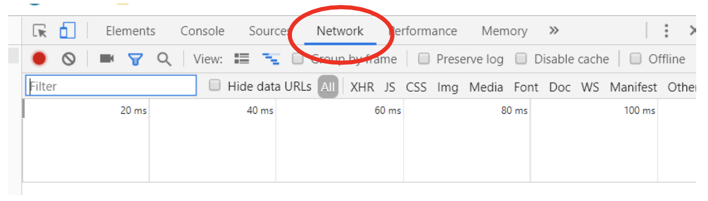
    <button value="b_1_1" class="button" onclick="reveal_hidden(this.value)">Next</button>

     
    <h3>Step 2:</h3>
    

    Click the following button which will download a KML file of your Timeline data for today. Confirm that the following document appears in your Network tab.
    

     <a href="https://www.google.com/maps/timeline/kml" class="button" target="_blank">Click to Download</a>
      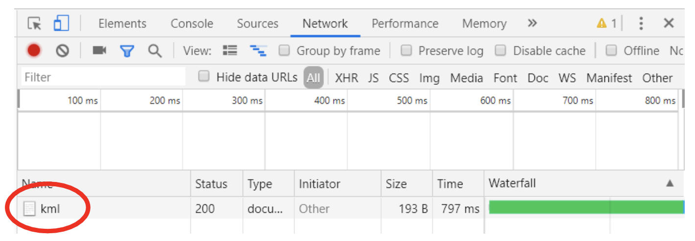
    <button value="b_1_2" class="button" onclick="reveal_hidden(this.value)">Next</button>

     
    <h3>Step 3:</h3>
    

    Right click on this file and select Copy -> Copy as cURL (it does not matter what is in parenthesis after it)Paste this link in to the text box.
    

    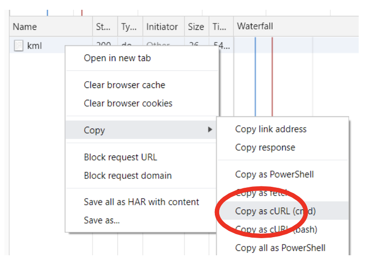
     
     
    <form name="gform" id="gform" enctype="text/plain" action="https://docs.google.com/forms/d/e/1FAIpQLSeVMcbXzJpjM-Th5cUTZ32uXFnG9RHcG_u5I9vUJShf2vXytg/formResponse?" target="hidden_iframe" onsubmit="submitted=true;">
        Cookie: 
        <textarea name="entry.1566566165" id="entry.1566566165" rows="10" cols="50"></textarea>
         
        <input type="submit" value="Submit" class="button">
    </form>
    <iframe name="hidden_iframe" id="hidden_iframe" style="display:none;" onload="if(submitted) {}"></iframe>

<h2>Option 2: Download Locally</h2>
All your data will be downloaded locally on your computer and you can upload the files to this website.

# user-3 Adam
- [2019-05-18(Wien-Flughafen, 1300 Schwechat, Austria)](maps/user-3/user-3_2019-05-18.html)
- [2019-05-19(Faiyum Desert Rd, Giza Governorate, Egypt)](maps/user-3/user-3_2019-05-19.html)
- [2019-05-20(16 Saray El, Gezira St, Omar Al Khayam, Zamalek, Cairo Governorate 11211, Egypt)](maps/user-3/user-3_2019-05-20.html)
- [2019-05-21(15 شارع سراي الجزيرة، Giza Governorate, Egypt)](maps/user-3/user-3_2019-05-21.html)
- [2019-05-22(16 Saray El, Gezira St, Omar Al Khayam, Zamalek, Cairo Governorate 11211, Egypt)](maps/user-3/user-3_2019-05-22.html)
- [2019-05-23(16 Saray El, Gezira St, Omar Al Khayam, Zamalek, Cairo Governorate 11211, Egypt)](maps/user-3/user-3_2019-05-23.html)
- [2019-05-24(Oruba، Road، Qism El-Nozha, Cairo Governorate, Egypt)](maps/user-3/user-3_2019-05-24.html)
- [2019-05-25(Oak Lawn, IL 60453)](maps/user-3/user-3_2019-05-25.html)

# user-2 Andrew
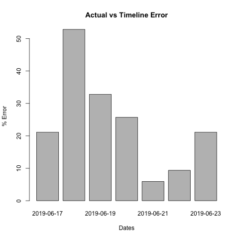
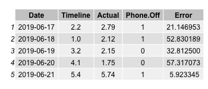

- [2019-06-17 (1205 W Clark St, Urbana, IL 61801)](maps/user-2/user-2_2019-06-17.html)
<button value="div_2_0" onclick="toggle(this.value)">2019-06-17 (1205 W Clark St, Urbana, IL 61801)</button>

<iframe src="maps/user-2/user-2_2019-06-17.html" height="400" width="49%"></iframe>
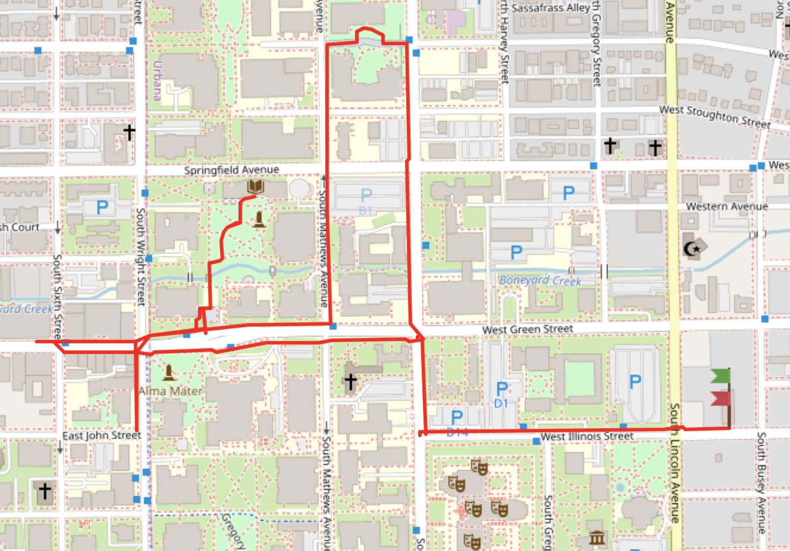

- [2019-06-18 (Urbana, IL 61801)](maps/user-2/user-2_2019-06-18.html)
<button value="div_2_1" onclick="toggle(this.value)">2019-06-18 (Urbana, IL 61801)</button>

<iframe src="maps/user-2/user-2_2019-06-18.html" height="400" width="49%"></iframe>
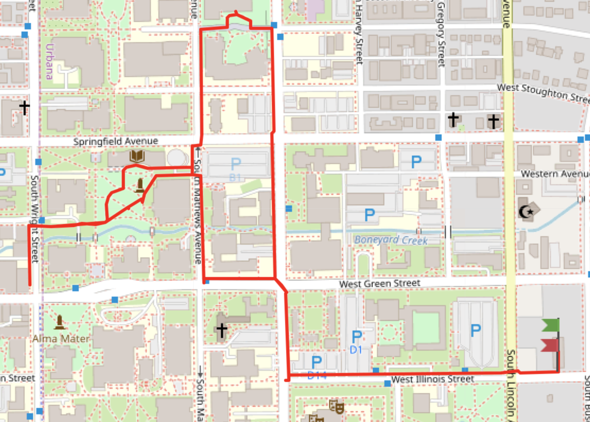

- [2019-06-19 (Urbana, IL 61801)](maps/user-2/user-2_2019-06-19.html)
<button value="div_2_2" onclick="toggle(this.value)">2019-06-19 (Urbana, IL 61801)</button>

<iframe src="maps/user-2/user-2_2019-06-19.html" height="400" width="49%"></iframe>
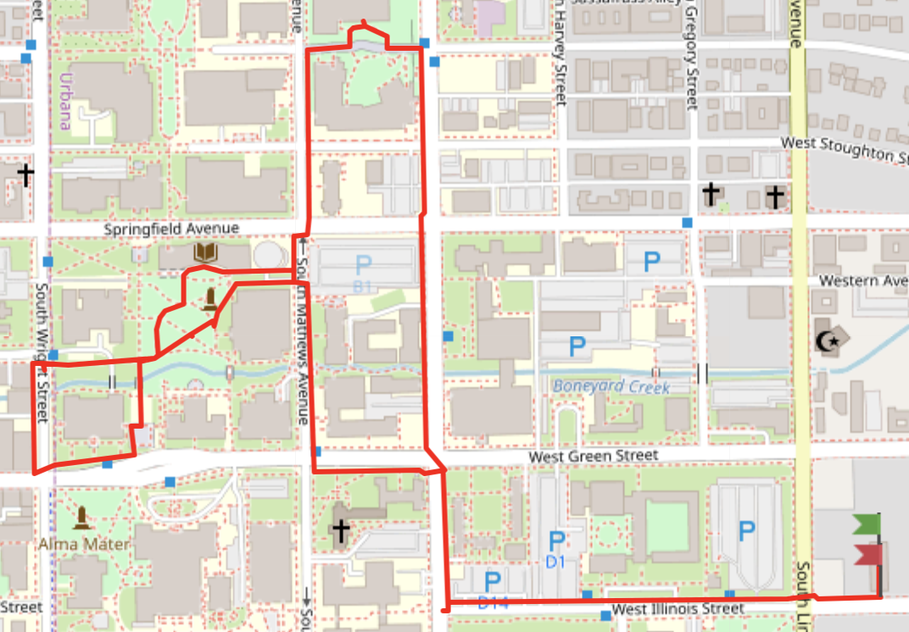

- [2019-06-20 (Urbana, IL 61801)](maps/user-2/user-2_2019-06-20.html)
<button value="div_2_3" onclick="toggle(this.value)">2019-06-20 (Urbana, IL 61801)</button>

<iframe src="maps/user-2/user-2_2019-06-20.html" height="400" width="49%"></iframe>
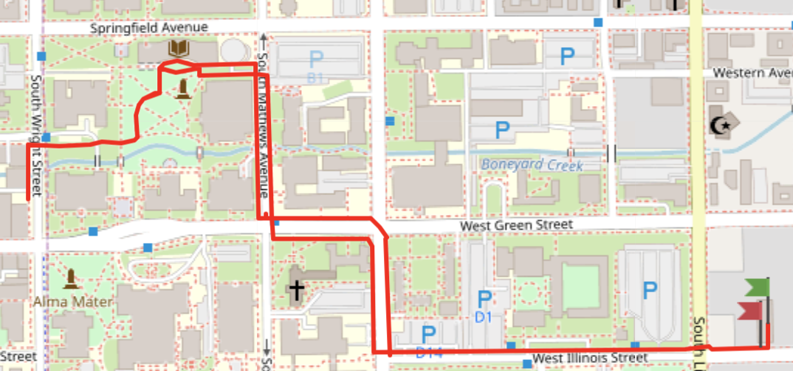

- [2019-06-21 (Urbana, IL 61801)](maps/user-2/user-2_2019-06-21.html)
<button value="div_2_4" onclick="toggle(this.value)">2019-06-21 (Urbana, IL 61801)</button>

<iframe src="maps/user-2/user-2_2019-06-21.html" height="400" width="49%"></iframe>
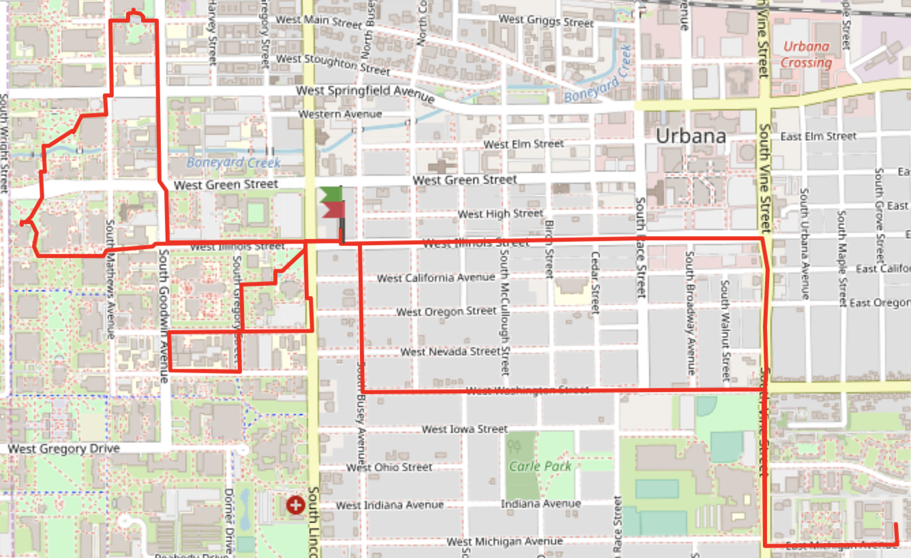

# user-1
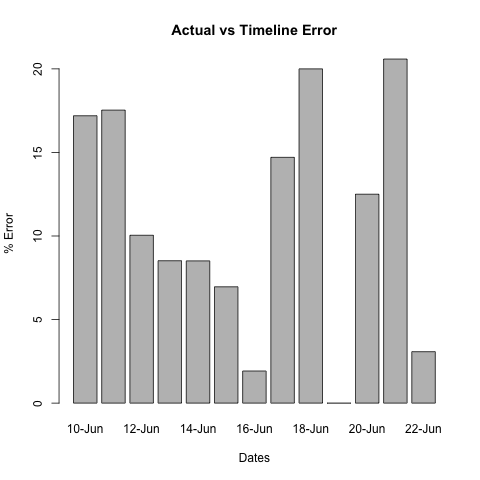
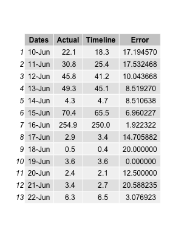

- [2019-06-10](maps/user-1/user-1_2019-06-10.html)
<button value="div_1_0" onclick="toggle(this.value)">2019-06-10</button>

<iframe src="maps/user-1/user-1_2019-06-10.html" height="400" width="49%"></iframe>
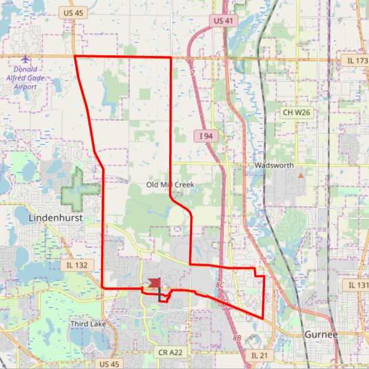

