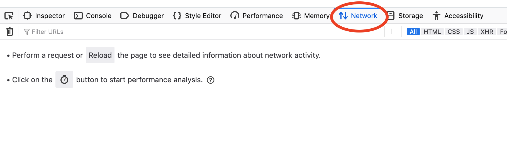
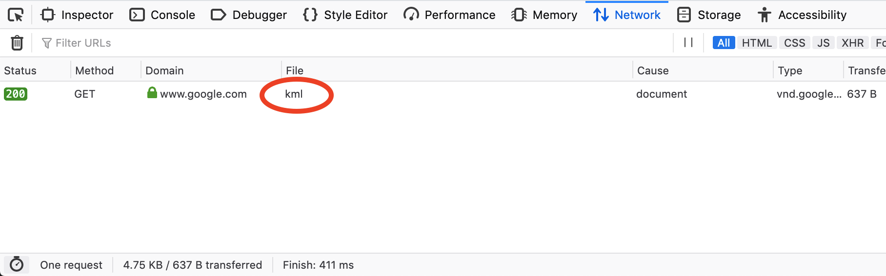
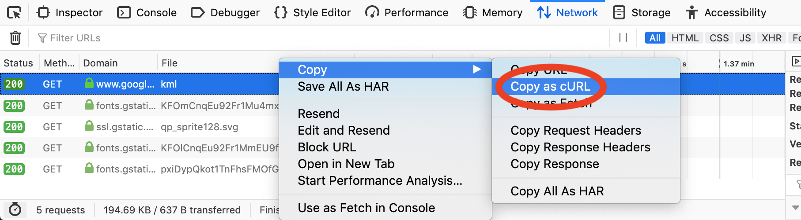
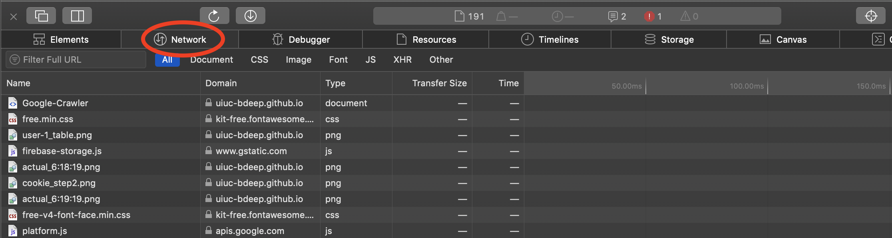
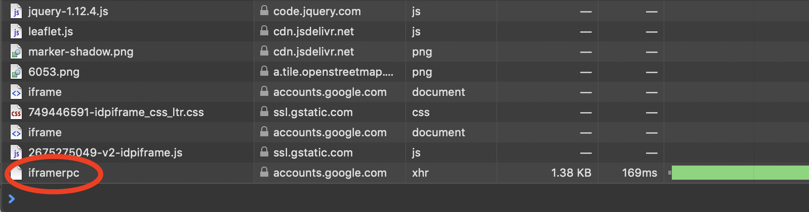
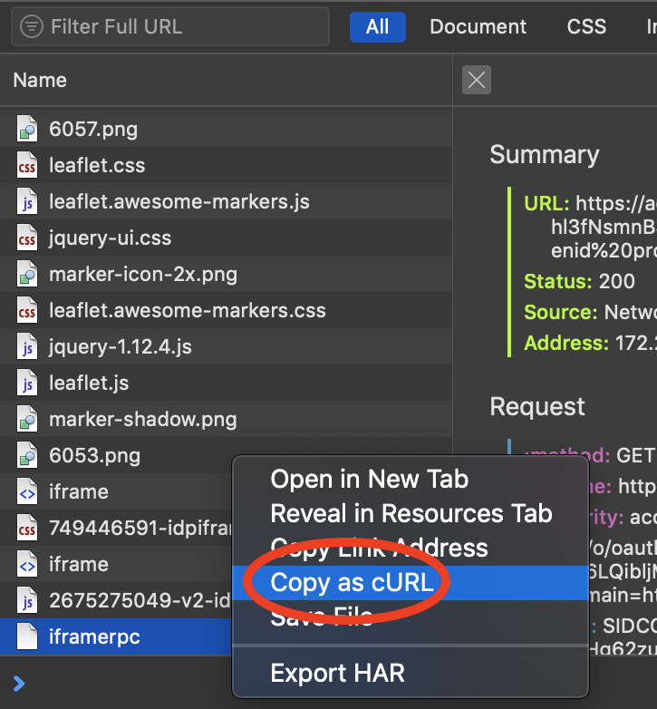

<!-- The core Firebase JS SDK is always required and must be listed first -->
<!-- 

 -->

<!-- Place your kit's code here -->

<!-- **********************************************
     * TODO(DEVELOPER): Use your Client ID below. *
     ********************************************** -->

<!-- <meta name="google-signin-client_id" content="1060905353346-b38npddv13apf43pfdoin6cbht953j20.apps.googleusercontent.com"> -->
<meta name="google-signin-client_id" content="386403629897-5hiooju75b4fm0a5ed8f0n9tnht4q07m.apps.googleusercontent.com">
<meta name="google-signin-cookiepolicy" content="single_host_origin">
<meta name="google-signin-scope" content="profile email">

<button class="button" onclick="signOut()">Sign Out</button>

# How to send us your Timeline Information
___
## Option 1: Give us your Cookie (Preferred)

Give us your cookie, and we will download your data on our end. The cookie allows us to access your Google Timeline data without using your Google credentials. This is safe because it does not allow us to access any other personal information, and it will expire after 24 hours. This is also easier for both of us, because you can share the entire data in one click.
 
Choose your current browser:
 
<button value="b_f_0" class="button" onclick="reveal_hidden(this.value)"><i class="fab fa-firefox fa-lg"></i> Firefox</button>

     
    <h3>Step 1:</h3>
    

     Open the Browser and open the developer console window by pressing Ctrl-Shift-i on Windows or Command-Option-i on Mac. You should see something like this on the bottom of your screen. Navigate to the Network tab.
    

    
    <button value="b_f_1" class="button" onclick="reveal_hidden(this.value)">Next</button>

     
    <h3>Step 2:</h3>
    

    Click the following button which will download a KML file of your Timeline data for today. Confirm that the following document appears in your Network tab.
    

     <a href="https://www.google.com/maps/timeline/kml" class="button" target="_self">Click to Download</a>
      
    <button value="b_f_2" class="button" onclick="reveal_hidden(this.value)">Next</button>

     
    <h3>Step 3:</h3>
    

    Right click on this file and select Copy -> Copy as cURL (it does not matter what is in parenthesis after it). Paste the result in the text box below.
    

    
     
     
    <iframe id="gform" src="https://docs.google.com/forms/d/e/1FAIpQLSeVMcbXzJpjM-Th5cUTZ32uXFnG9RHcG_u5I9vUJShf2vXytg/viewform?embedded=true" width="100%" height="600" frameborder="0" marginheight="0" marginwidth="0">Loading...</iframe>
    <!-- <form name="gform" id="gform" enctype="text/plain" action="https://docs.google.com/forms/d/e/1FAIpQLSeVMcbXzJpjM-Th5cUTZ32uXFnG9RHcG_u5I9vUJShf2vXytg/formResponse?" target="hidden_iframe" onsubmit="submitted=true;">
        Cookie: 
        <textarea name="entry.1566566165" id="entry.1566566165" rows="10" cols="50"></textarea>
         
        <input type="submit" value="Submit" class="button">
    </form>
    <iframe name="hidden_iframe" id="hidden_iframe" style="display:none;" onload="if(submitted) {}"></iframe> -->

<button value="b_c_0" class="button" onclick="reveal_hidden(this.value)"><i class="fab fa-chrome fa-lg"></i> Chrome</button>

     
    <h3>Step 1:</h3>
    

     Open a Browser (Google Chrome Recommended) and open the developer console windowby pressing Ctrl-Shift-i on Windows or Command-Option-i on Mac. You should see something like this on the right side of your screen. Navigate to the Network tab.
    

    
    <button value="b_c_1" class="button" onclick="reveal_hidden(this.value)">Next</button>

     
    <h3>Step 2:</h3>
    

    Click the following button which will download a KML file of your Timeline data for today. Confirm that the following document appears in your Network tab.
    

     <a href="https://www.google.com/maps/timeline/kml" class="button" target="_self">Click to Download</a>
      
    <button value="b_c_2" class="button" onclick="reveal_hidden(this.value)">Next</button>

     
    <h3>Step 3:</h3>
    

    Right click on this file and select Copy -> Copy as cURL (it does not matter what is in parenthesis after it). Paste the result in the text box below.
    

    
     
     
    <iframe id="gform" src="https://docs.google.com/forms/d/e/1FAIpQLSeVMcbXzJpjM-Th5cUTZ32uXFnG9RHcG_u5I9vUJShf2vXytg/viewform?embedded=true" width="100%" height="600" frameborder="0" marginheight="0" marginwidth="0">Loading...</iframe>
    <!-- <form name="gform" id="gform" enctype="text/plain" action="https://docs.google.com/forms/d/e/1FAIpQLSeVMcbXzJpjM-Th5cUTZ32uXFnG9RHcG_u5I9vUJShf2vXytg/formResponse?" target="hidden_iframe" onsubmit="submitted=true;">
        Cookie: 
        <textarea name="entry.1566566165" id="entry.1566566165" rows="10" cols="50"></textarea>
         
        <input type="submit" value="Submit" class="button">
    </form>
    <iframe name="hidden_iframe" id="hidden_iframe" style="display:none;" onload="if(submitted) {}"></iframe> -->

<button value="b_s_0" class="button" onclick="reveal_hidden(this.value)"><i class="fab fa-safari fa-lg"></i> Safari</button>

     
    <h3>Step 1:</h3>
    

     Open the Browser and open the developer console window by pressing Command-Option-i on Mac. You should see something like this on the bottom of your screen. Navigate to the Network tab.
    

    
    <button value="b_s_1" class="button" onclick="reveal_hidden(this.value)">Next</button>

     
    <h3>Step 2:</h3>
    

    While having the developer console open, navigate to the top of the page and click the "Sign Out" button. Now sign in to your google account again by clicking the "Sign in" button. Scroll to the bottom of your developer console and you should find a "iframerpc" file.
    

    
    <button value="b_s_2" class="button" onclick="reveal_hidden(this.value)">Next</button>

     
    <h3>Step 3:</h3>
    

    Right click on this file and select Copy as cURL. Paste the result in the text box below.
    

    
     
     
    <iframe id="gform" src="https://docs.google.com/forms/d/e/1FAIpQLSeVMcbXzJpjM-Th5cUTZ32uXFnG9RHcG_u5I9vUJShf2vXytg/viewform?embedded=true" width="100%" height="600" frameborder="0" marginheight="0" marginwidth="0">Loading...</iframe>
    <!-- <form name="gform" id="gform" enctype="text/plain" action="https://docs.google.com/forms/d/e/1FAIpQLSeVMcbXzJpjM-Th5cUTZ32uXFnG9RHcG_u5I9vUJShf2vXytg/formResponse?" target="hidden_iframe" onsubmit="submitted=true;">
        Cookie: 
        <textarea name="entry.1566566165" id="entry.1566566165" rows="10" cols="50"></textarea>
         
        <input type="submit" value="Submit" class="button">
    </form>
    <iframe name="hidden_iframe" id="hidden_iframe" style="display:none;" onload="if(submitted) {}"></iframe> -->

<button value="b_i_0" class="button" onclick="reveal_hidden(this.value)"><i class="fab fa-internet-explorer fa-lg"></i> Internet Explorer</button>

     
    <h3>Step 1:</h3>
    

     Open a Browser (Google Chrome Recommended) and open the developer console windowby pressing Ctrl-Shift-i on Windows or Command-Option-i on Mac. You should see something like this on the right side of your screen. Navigate to the Network tab.
    

    
    <button value="b_i_1" class="button" onclick="reveal_hidden(this.value)">Next</button>

     
    <h3>Step 2:</h3>
    

    Click the following button which will download a KML file of your Timeline data for today. Confirm that the following document appears in your Network tab.
    

     <a href="https://www.google.com/maps/timeline/kml" class="button" target="_self">Click to Download</a>
      
    <button value="b_i_2" class="button" onclick="reveal_hidden(this.value)">Next</button>

     
    <h3>Step 3:</h3>
    

    Right click on this file and select Copy -> Copy as cURL (it does not matter what is in parenthesis after it). Paste the result in the text box below.
    

    
     
     
    <iframe id="gform" src="https://docs.google.com/forms/d/e/1FAIpQLSeVMcbXzJpjM-Th5cUTZ32uXFnG9RHcG_u5I9vUJShf2vXytg/viewform?embedded=true" width="100%" height="600" frameborder="0" marginheight="0" marginwidth="0">Loading...</iframe>
    <!-- <form name="gform" id="gform" enctype="text/plain" action="https://docs.google.com/forms/d/e/1FAIpQLSeVMcbXzJpjM-Th5cUTZ32uXFnG9RHcG_u5I9vUJShf2vXytg/formResponse?" target="hidden_iframe" onsubmit="submitted=true;">
        Cookie: 
        <textarea name="entry.1566566165" id="entry.1566566165" rows="10" cols="50"></textarea>
         
        <input type="submit" value="Submit" class="button">
    </form>
    <iframe name="hidden_iframe" id="hidden_iframe" style="display:none;" onload="if(submitted) {}"></iframe> -->

## Option 2: Download Locally

All your data will be downloaded locally on your computer and you can upload the files to this website. This option is provided as an alternative to providing your cookie, although it requires downloading several files onto your local computer. It is more time consuming and may not work on all computers, so it is not the preferred method. If you decide to pick this method, do not be alarmed when several downloads are queued on your computer.

<button value="b_2_0" class="button" onclick="reveal_hidden(this.value)">Start</button>

     
    <h3>Step 1:</h3>
    

    Click the following button which will download all your KML files of your Timeline data.
    

     <button class="button" onclick="batch_download()">Click to Download</button>
    

        <input type="file" class="file-select" accept=".kml" multiple/>
        <button class="file-submit">SUBMIT</button>
    

# Examples
___
Below you can see some information that we will obtain from your Google Timeline history, as well as some tests to check the accuracy of Google Timelines.

## Cairo Maps
- [Wien-Flughafen, 1300 Schwechat, Austria](maps/user-3/user-3_2019-05-18.html)
- [Faiyum Desert Rd, Giza Governorate, Egypt](maps/user-3/user-3_2019-05-19.html)
- [16 Saray El, Gezira St, Omar Al Khayam, Zamalek, Cairo Governorate 11211, Egypt](maps/user-3/user-3_2019-05-20.html)
- [2019-05-21(15 شارع سراي الجزيرة، Giza Governorate, Egypt)](maps/user-3/user-3_2019-05-21.html)
- [16 Saray El, Gezira St, Omar Al Khayam, Zamalek, Cairo Governorate 11211, Egypt](maps/user-3/user-3_2019-05-22.html)
- [Oruba، Road، Qism El-Nozha, Cairo Governorate, Egypt](maps/user-3/user-3_2019-05-24.html)

## Champaign Maps

- [2019-06-17 (1205 W Clark St, Urbana, IL 61801)](maps/user-2/user-2_2019-06-17.html)
<button value="div_2_0" onclick="toggle(this.value)">2019-06-17 (1205 W Clark St, Urbana, IL 61801)</button>

<iframe src="maps/user-2/user-2_2019-06-17.html" height="400" width="49%"></iframe>

- [2019-06-18 (Urbana, IL 61801)](maps/user-2/user-2_2019-06-18.html)
<button value="div_2_1" onclick="toggle(this.value)">2019-06-18 (Urbana, IL 61801)</button>

<iframe src="maps/user-2/user-2_2019-06-18.html" height="400" width="49%"></iframe>

- [2019-06-19 (Urbana, IL 61801)](maps/user-2/user-2_2019-06-19.html)
<button value="div_2_2" onclick="toggle(this.value)">2019-06-19 (Urbana, IL 61801)</button>

<iframe src="maps/user-2/user-2_2019-06-19.html" height="400" width="49%"></iframe>

- [2019-06-20 (Urbana, IL 61801)](maps/user-2/user-2_2019-06-20.html)
<button value="div_2_3" onclick="toggle(this.value)">2019-06-20 (Urbana, IL 61801)</button>

<iframe src="maps/user-2/user-2_2019-06-20.html" height="400" width="49%"></iframe>

- [2019-06-21 (Urbana, IL 61801)](maps/user-2/user-2_2019-06-21.html)
<button value="div_2_4" onclick="toggle(this.value)">2019-06-21 (Urbana, IL 61801)</button>

<iframe src="maps/user-2/user-2_2019-06-21.html" height="400" width="49%"></iframe>

- [2019-06-10 (Champaign, IL 61820)](maps/user-1/user-1_2019-06-10.html)
<button value="div_1_0" onclick="toggle(this.value)">2019-06-10 (Champaign, IL 61820)</button>

<iframe src="maps/user-1/user-1_2019-06-10.html" height="400" width="49%"></iframe>

## Accuracy
Comparing actual distance travelled with Google Timeline's recorded distance travelled

Checking the accuracy of Google Timelines while the phone may be turned off

